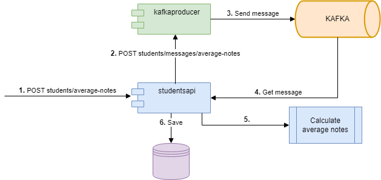
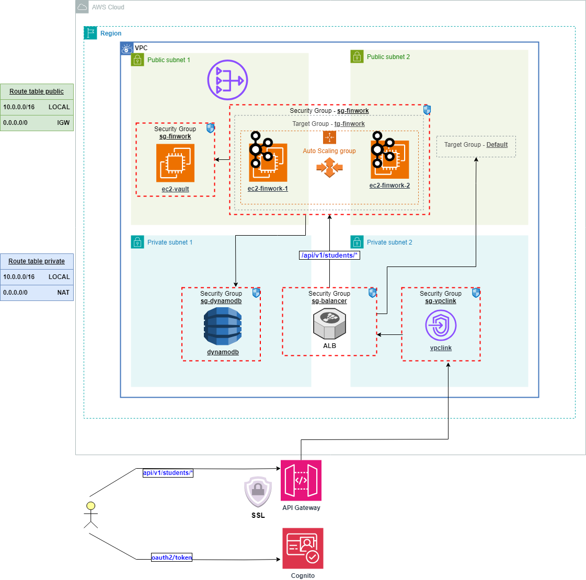

# Api Students


This project implements a RESTful API for managing student data. It provides basic CRUD (Create, Read, Update, Delete) operations for student resources. The data storage backend is DynamoDB, a fully managed NoSQL database service provided by AWS.

In addition to the CRUD operations, the API includes a method to calculate the average grade of a student. The notes are then sent to a Kafka broker for processing by a consumer, calculating the average grade, the result is stored back in the database.

## Average Notes flow



# Technologies Used

- Java
- Spring Boot
- Amazon DynamoDB
- Apache Kafka
- Vault

# Getting Started

## Prerequisites

### Local

- Docker
- Java
- Maven

### AWS

- AWS Account
- AWS CLI

## Installing

### Local

- Deploy the following containers using Docker [docker-compose.yml](src/main/resources/local/docker/docker-compose.yml) (**NOTE:** Replace the IP address `192.168.1.8` with your local one)
- Clone the repository.
- Build the project using Maven: `mvn clean package`
- Run the application: `java -jar target/studentsapi-0.0.1-SNAPSHOT.jar`
- Access the API endpoints using your preferred HTTP client.

### AWS

- Run the following cloudformation files
  - [0-dynamodb.yml](src/main/resources/aws/cloud-formation/0-dynamodb.yml)
  - [1-vpc.yml](src/main/resources/aws/cloud-formation/1-vpc.yml)
  - [2-sg.yml](src/main/resources/aws/cloud-formation/2-sg.yml)
  - [3-asg-alb.yml](src/main/resources/aws/cloud-formation/3-asg-alb.yml)
  - [4-vpclink-apigw.yml](src/main/resources/aws/cloud-formation/4-vpclink-apigw.yml)

- Deploy the following docker-compose within the generated instances
  - Vault: [docker-compose.yml](src/main/resources/aws/docker/vault/docker-compose.yml) (**NOTE:** Vault is running on a different EC2)
  - Kafka and Services: [docker-compose.yml](src/main/resources/aws/docker/docker-compose.yml) (**NOTE:** Replace the IP address `10.0.30.106` with your vault EC2)

#### Resulting:



# API

## Endpoints

- `GET /api/v1/students`: Retrieve all students
- `GET /api/v1/students/{id}`: Retrieve a student by ID
- `POST /api/v1/students`: Save a student
- `DELETE /api/v1/students/{id}`: Delete a student
- `POST /api/v1/students/average-notes`: Save student with average notes

## Body 

````
Student{
dni*	      string
name*	      string
notes*	      [number($double)]
averageNotes  number($double)
}
````
## Documentation

http://localhost:8080/swagger-ui/index.html

## Examples

### Request POST

`POST` http://localhost:8080/api/v1/students/average-notes

#### Body

````
{
  "dni": "123",
  "name": "Pedro",
  "notes": [
    1.0,
    2.0,
    3.0
  ]
}
````

### Response

`OK`

### Request GET

`GET` http://localhost:8080/api/v1/students/123

### Response

````
{
  "dni": "123",
  "name": "Pedro",
  "notes": [
    1.0,
    2.0,
    3.0
  ],
  "averageNotes": 2.0
}
````